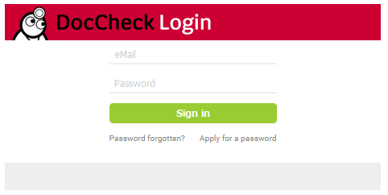
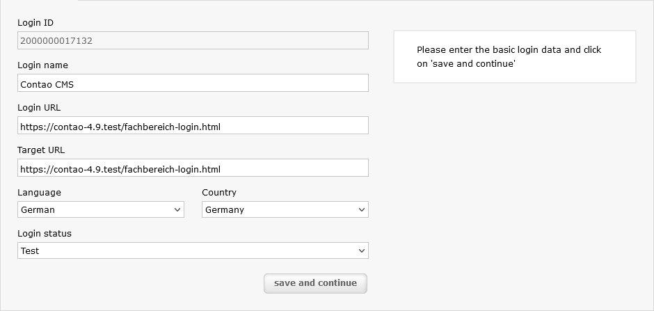

[](https://packagist.org/packages/tastaturberuf/contao-doccheck-login-bundle)
[](https://contao.org)
[](https://github.com/Tastaturberuf/contao-doccheck-login-bundle)
[](https://github.com/Tastaturberuf/contao-doccheck-login-bundle/commits/main)

# Contao Doccheck Login Bundle

With this Contao bundle you can easily implement the [DocCheck](https://www.doccheck.com/) login.

## Frontend



## Backend

There is a new frontend module under the application section called **DocCheck login**.

## Important

In the DocCheck login management you must set the target url to the frontend site where the module is placed.



## Install

### via Composer
```
composer require tastaturberuf/contao-doccheck-login-bundle
```
### via Contao Manager
search for `tastaturberuf/contao-doccheck-login-bundle`

➡ [Link to the Contao Extension Repository](https://extensions.contao.org/?p=tastaturberuf%2Fcontao-doccheck-login-bundle)


## Translations

- [ ] Chinese - 中文(简体)
- [ ] Czech - Čeština
- [ ] Dutch - Nederlands
- [x] English - English
- [ ] French - Français
- [x] German - Deutsch
- [ ] Italian - Italiano
- [ ] Japanese - 日本語
- [ ] Latvian - Latviešu
- [ ] Persian - فارسی
- [ ] Polish - Polski
- [ ] Portuguese - Português
- [ ] Russian - Русский
- [ ] Serbian - Српски
- [ ] Spanish - Español

## Sponsors
Many thanks to the initial sponsor Andreas Kroll @akroii

## Maintainer
[Andreas Kroll](https://github.com/akroii) & [Tastaturberuf](https://tastaturberuf.de) **with ♥ and Contao**
